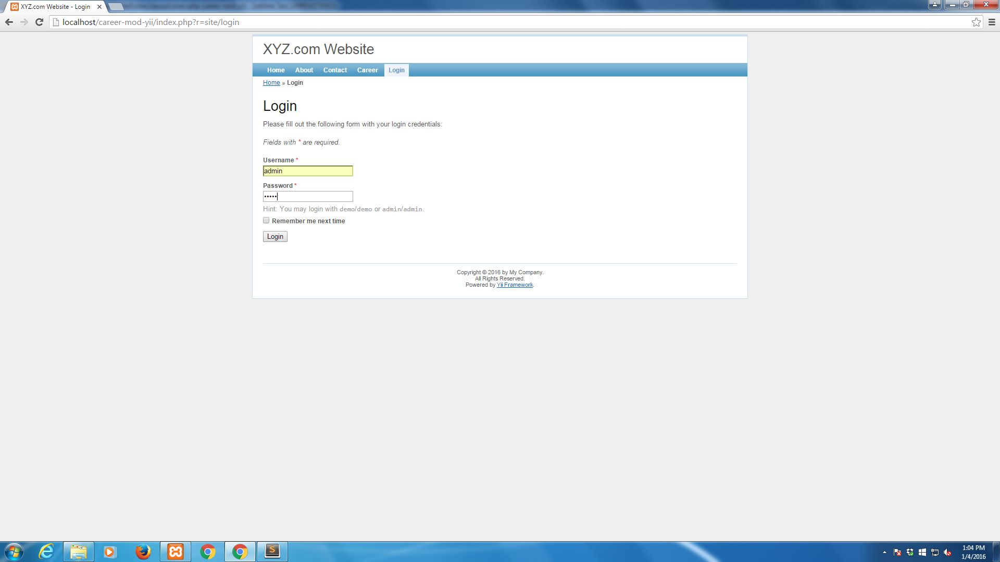

# Career Module for Your **Yii 1.1** Based Website or Web application
Ready to use Career Module for Your Yii Based Website or Web application

This career module is ready to use career page for your yii based website.

Following are the list of features

1. Admin can create Job Description (Opportunities)

#### Login As Admin

2. These Opportunities are viewed for Guest Users without login.
3. Candidates can apply for these opportunities
4. Admin would be able to view list of candidates applied for a particular job position.

The database schema can be found inside `sql` folder :`xyz_career.sql`

This code is under GNU GPL V2 license. Feel free to use this in your Yii Based website.

## To Start Using Follow the instructions below

1. Create the relevant schema from `sql\xyz_career.sql`

2. Copy `JobApplicationController.php` and `JobDescriptionController.php` in the controller folder

3. Copy `JobApplication.php` and `JobDescription.php` in the model folder

4. Copy `jobApplication`, `jobDescription` folder, present in the view folder inside views folder

5. Make sure you have a empty folder `user_uploads` just app root folder, this is where the resumes are uploaded.
